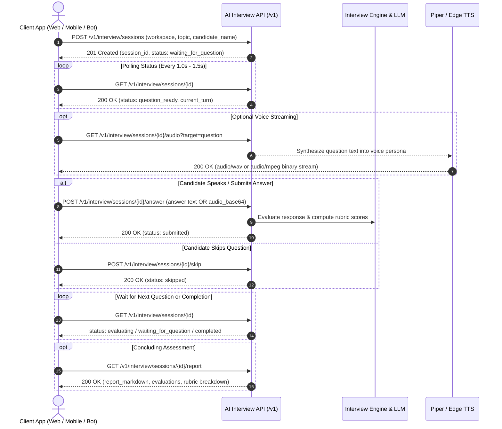

# AI Interview & Knowledge Microservice — Developer Integration Guide

Welcome to the **AI Interview & Knowledge Microservice API**. This guide provides complete documentation, workflows, and copy-pasteable code examples in **cURL**, **Python**, and **JavaScript/TypeScript** for developers integrating the AI interview and knowledge engine into external applications (Web apps, Mobile apps, SaaS platforms, Discord/Slack bots, and backend services).

---

## 1. Quick Reference & Endpoints

### Base URL
- **Production Server:** `https://voice.tinkerlab.online`
- **Local Development:** `https://localhost:8000` (or `http://localhost:8000` without SSL)

### Interactive Documentation & Schemas
| Resource | URL | Description |
|---|---|---|
| **Interactive Swagger UI** | [`/docs`](https://voice.tinkerlab.online/docs) | Interactive testing playground to try every endpoint directly in your browser. |
| **OpenAPI 3.0.3 Spec** | [`/openapi.json`](https://voice.tinkerlab.online/openapi.json) | Machine-readable OpenAPI schema to generate client SDKs in any language. |
| **System Health Check** | [`/v1/health`](https://voice.tinkerlab.online/v1/health) | Ping endpoint to monitor service and LLM availability. |
| **System Status** | [`/v1/status`](https://voice.tinkerlab.online/v1/status) | Returns active model, database info, and indexed corpus size. |
| **Audio Service Health** | [`/v1/audio/health`](https://voice.tinkerlab.online/v1/audio/health) | Real-time Whisper ASR and Piper TTS engine / device status. |
| **Speech-to-Text (ASR)** | `/v1/audio/transcribe` | Transcribes speech audio with acoustic confidence metadata. |
| **Text-to-Speech (TTS)** | `/v1/audio/synthesize` | Direct audio voice synthesis with 9 examiner personas. |

---

## 2. Architecture & Interview Lifecycle



---

## 3. Quick Start (5-Minute Integration)

### Python (Zero External Dependencies)
Use our pre-built Python SDK located in [`sdk/python/interview_client.py`](file:///home/ubuntu/exam_shekhar/Video_model_train/sdk/python/interview_client.py):

```python
import time
from sdk.python.interview_client import InterviewClient

# Initialize client (verify_ssl=False if using self-signed local cert)
client = InterviewClient(base_url="https://voice.tinkerlab.online", verify_ssl=False)

# 1. Start a new interview session
sess = client.start_session(
    workspace_id="ws_yocto",
    topic="all",
    candidate_name="Alex Taylor",
    questions=3,
    voice_profile="emma"
)
session_id = sess["session_id"]
print(f"Session started: {session_id} with interviewer {sess.get('interviewer_name')}")

# 2. Poll until the first question is generated
while True:
    state = client.poll_session(session_id)
    if state["status"] == "question_ready":
        turn = state["current_turn"]
        print(f"\n[Interviewer asks]: {turn['question']}")
        print(f"Difficulty: {turn['difficulty']}/5 | Evidence: {turn.get('evidence_cites')}")
        break
    time.sleep(1.2)

# 3. Stream spoken audio
audio_bytes = client.get_audio(session_id, target="question")
with open("question.wav", "wb") as f:
    f.write(audio_bytes)
print("Saved question audio to question.wav")

# 4. Submit an answer (plain text or audio base64)
res = client.submit_answer(session_id, answer_text="BitBake layer priority is set by BBFILE_PRIORITY in layer.conf.")
print("Answer submitted successfully!")
```

---

### JavaScript / TypeScript
Use our pre-built TypeScript SDK located in [`sdk/typescript/interview_client.ts`](file:///home/ubuntu/exam_shekhar/Video_model_train/sdk/typescript/interview_client.ts):

```typescript
import { InterviewServiceClient } from "./sdk/typescript/interview_client";

const client = new InterviewServiceClient("https://voice.tinkerlab.online");

async function runInterview() {
  // 1. Start session
  const session = await client.startSession({
    workspace_id: "ws_yocto",
    candidate_name: "Alex Taylor",
    questions: 3,
    voice_profile: "emma"
  });
  console.log("Session ID:", session.session_id);

  // 2. Poll for question
  let state = await client.pollSession(session.session_id);
  while (state.status !== "question_ready") {
    await new Promise(r => setTimeout(r, 1200));
    state = await client.pollSession(session.session_id);
  }
  console.log("Question:", state.current_turn?.question);

  // 3. Submit candidate response
  await client.submitAnswer(session.session_id, "In Yocto, recipes define compilation tasks.");
  console.log("Submitted answer for evaluation!");
}

runInterview();
```

---

## 4. Complete API Reference

### 4.1 System & Health

#### `GET /v1/health`
Verifies server health and LLM connectivity.

**Response (`200 OK`):**
```json
{
  "status": "healthy",
  "model": "qwen3.5:latest",
  "timestamp": 1789245830.12
}
```

**cURL Example:**
```bash
curl -k -X GET "https://voice.tinkerlab.online/v1/health"
```

---

#### `GET /v1/status`
Returns database statistics and training corpus counts.

**Response (`200 OK`):**
```json
{
  "model": "qwen3.5:latest",
  "db": "/home/ubuntu/exam_shekhar/Video_model_train/knowledge.db",
  "corpus_records": 676,
  "status": "online",
  "version": "1.0.0"
}
```

---

### 4.2 Interview Session Management

#### `POST /v1/interview/sessions`
Initializes an adaptive interview session with grounded questions and AI personality.

**Request Body (`application/json`):**
| Parameter | Type | Required | Default | Description |
|---|---|---|---|---|
| `workspace_id` | string | No | `"ws_ielts"` | ID of workspace to source evidence from (e.g. `ws_yocto`, `ws_ielts`). |
| `topic` | string | No | `"all"` | Specific topic or `"all"` to cover all workspace materials. |
| `candidate_name` | string | No | `""` | Full candidate name for conversational greetings and report. |
| `questions` | integer | No | `5` | Maximum number of questions (3 = Quick, 5 = Standard, 8 = Deep). |
| `minutes` | integer | No | `30` | Maximum interview session time in minutes. |
| `use_graph` | boolean | No | `true` | When true, traverses prerequisites via Concept Graph topology. |
| `include_intro` | boolean | No | `true` | When true, begins with a warm-up conversational introduction. |
| `voice_profile` | string | No | `"emma"` | Interviewer persona (options: `emma`, `sarah`, `chloe`, `pooja`, `liam`, `james`, `arthur`, `david`, `rohan`). |
| `speed_rate` | number | No | `1.0` | Speaking rate multiplier (`0.85` to `1.25`). |

**Request Example:**
```json
{
  "workspace_id": "ws_yocto",
  "topic": "all",
  "candidate_name": "Shekhar Sharma",
  "questions": 3,
  "voice_profile": "emma",
  "speed_rate": 1.0,
  "use_graph": true
}
```

**Response (`201 Created`):**
```json
{
  "session_id": "sess_42bc83a4",
  "status": "waiting_for_question",
  "candidate_name": "Shekhar Sharma",
  "interviewer_name": "Emma",
  "created_at": 1789245836.25
}
```

**cURL Example:**
```bash
curl -k -X POST "https://voice.tinkerlab.online/v1/interview/sessions" \
  -H "Content-Type: application/json" \
  -d '{
    "workspace_id": "ws_yocto",
    "topic": "all",
    "candidate_name": "Shekhar Sharma",
    "questions": 3,
    "voice_profile": "emma"
  }'
```

---

#### `GET /v1/interview/sessions/{id}`
Polls current turn, question text, evidence citations, candidate score, and status.

**Session Status Lifecycle:**
- `"waiting_for_question"`: Background worker is generating the grounded question.
- `"question_ready"`: Question is generated; candidate should speak or type their answer.
- `"evaluating"`: Candidate submitted an answer; LLM is scoring against rubrics.
- `"completed"`: All questions finished; report is finalized.
- `"error"`: Error encountered (details in `"error"` field).

**Response (`200 OK`):**
```json
{
  "session_id": "sess_42bc83a4",
  "status": "question_ready",
  "candidate_name": "Shekhar Sharma",
  "interviewer_name": "Emma",
  "voice_profile": "emma",
  "max_questions": 3,
  "current_turn": {
    "index": 1,
    "topic": "Layers & BitBake",
    "difficulty": 3,
    "question": "When two layers provide the same recipe, how does BitBake decide which recipe file to use, and how does that differ from how bbappends are applied?",
    "spoken_text": "When two layers provide the same recipe, how does BitBake decide which recipe file to use, and how does that differ from how bbappends are applied?",
    "question_type": "technical",
    "is_followup": false,
    "is_intro": false,
    "evidence_cites": ["passages (p.1)"],
    "expected_concepts": ["BBFILE_PRIORITY", "layer.conf", "BBLAYERS", "append order"],
    "conversational_prompt": null
  },
  "latest_eval": {
    "mean": 4.25,
    "correctness": 5,
    "technical_depth": 4,
    "reasoning": 4,
    "completeness": 4,
    "human_feedback": "Excellent explanation of BBFILE_PRIORITY! You clearly articulated that priority chooses the recipe file while appends stack.",
    "missing_concepts": []
  },
  "last_candidate_answer": "BitBake picks the recipe with the higher BBFILE_PRIORITY number.",
  "history": []
}
```

**cURL Example:**
```bash
curl -k -X GET "https://voice.tinkerlab.online/v1/interview/sessions/sess_42bc83a4"
```

---

#### `POST /v1/interview/sessions/{id}/answer`
Submits the candidate's response. Supports either **plain text** or **base64-encoded audio**.

**Request Body (`application/json`):**
- **Option 1: Plain Text**
  ```json
  {
    "answer": "BitBake checks BBFILE_PRIORITY in layer.conf. If priorities are equal, it uses the layer order in BBLAYERS."
  }
  ```
- **Option 2: Raw Audio (Base64)**
  ```json
  {
    "audio_base64": "GkXfo59ChoEBQveBAULygQ8UA85Glc8VLZWdgIIA9H+VhNW1Znd...",
    "audio_format": "webm"
  }
  ```
  *(Supported formats: `webm`, `wav`, `ogg`. Audio is transcribed automatically via local Whisper before grading).*

**Response (`200 OK`):**
```json
{
  "status": "submitted",
  "session_id": "sess_42bc83a4",
  "answer": "BitBake checks BBFILE_PRIORITY in layer.conf...",
  "transcription": null
}
```

**cURL Example:**
```bash
curl -k -X POST "https://voice.tinkerlab.online/v1/interview/sessions/sess_42bc83a4/answer" \
  -H "Content-Type: application/json" \
  -d '{"answer": "BitBake checks BBFILE_PRIORITY in layer.conf."}'
```

---

#### `POST /v1/interview/sessions/{id}/skip`
Skips the current question turn and advances to the next question.

**Response (`200 OK`):**
```json
{
  "status": "skipped",
  "session_id": "sess_42bc83a4"
}
```

**cURL Example:**
```bash
curl -k -X POST "https://voice.tinkerlab.online/v1/interview/sessions/sess_42bc83a4/skip" \
  -H "Content-Type: application/json" \
  -d '{}'
```

---

#### `GET /v1/interview/sessions/{id}/audio`
Streams synthesized speech audio for candidate playback.

**Query Parameters:**
| Parameter | Type | Default | Description |
|---|---|---|---|
| `target` | string | `"question"` | What content to stream: `"question"` (question text), `"feedback"` (examiner feedback), or `"conversational"` (warm greeting/reply). |
| `text` | string | `null` | Optional custom string override to synthesize in the interviewer's voice. |

**Response:**
- `Content-Type: audio/wav` (or `audio/mpeg`)
- Binary audio stream.

**cURL Example:**
```bash
# Save question speech to file
curl -k -X GET "https://voice.tinkerlab.online/v1/interview/sessions/sess_42bc83a4/audio?target=question" \
  --output question.wav
```

---

#### `GET /v1/interview/sessions/{id}/report`
Retrieves the candidate's final evaluation report in Markdown and structured rubric scores.

**Response (`200 OK`):**
```json
{
  "session_id": "sess_42bc83a4",
  "status": "completed",
  "report_markdown": "# Candidate Technical Evaluation Report\n\n**Candidate:** Shekhar Sharma\n**Topic:** Yocto Project & Embedded Linux\n**Overall Score:** 4.2 / 5.0\n...",
  "candidate_name": "Shekhar Sharma",
  "interviewer_name": "Emma",
  "turns_completed": 3,
  "evaluations": [
    {
      "turn_index": 1,
      "topic": "Layers & BitBake",
      "question": "How does BitBake prioritize recipes across layers?",
      "candidate_answer": "Higher BBFILE_PRIORITY wins.",
      "eval": {
        "mean": 4.5,
        "correctness": 5,
        "technical_depth": 4,
        "human_feedback": "Accurate and concise!"
      }
    }
  ]
}
```

---

### 4.3 Workspace & Knowledge Ingestion

#### `GET /v1/workspaces`
Lists all available workspaces, source counts, and chunk statistics.

**Response (`200 OK`):**
```json
{
  "workspaces": [
    {
      "id": "ws_yocto",
      "name": "Yocto Project & Embedded Linux",
      "subject": "Embedded Linux",
      "description": "BitBake recipes, layer hierarchies, sstate cache",
      "n_sources": 6,
      "n_chunks": 88,
      "n_topics": 9
    },
    {
      "id": "ws_ielts",
      "name": "IELTS Speaking Masterclass",
      "subject": "English Fluency",
      "n_sources": 85,
      "n_chunks": 928,
      "n_topics": 272
    }
  ]
}
```

---

#### `POST /v1/workspaces`
Creates a new isolated training workspace.

**Request Body (`application/json`):**
```json
{
  "id": "ws_cloud_native",
  "name": "Cloud Native Kubernetes",
  "subject": "DevOps & Infrastructure",
  "description": "Pod lifecycles, Ingress controllers, and Helm charts",
  "topics": ["Ingress & Services", "Persistent Volumes", "StatefulSets"]
}
```

**Response (`201 Created`):**
```json
{
  "status": "created",
  "workspace": {
    "id": "ws_cloud_native",
    "name": "Cloud Native Kubernetes",
    "subject": "DevOps & Infrastructure",
    "status": "READY",
    "topics": [
      {"id": "top_ingress___services_81a2", "name": "Ingress & Services"},
      {"id": "top_persistent_volumes_b912", "name": "Persistent Volumes"},
      {"id": "top_statefulsets_44c1", "name": "StatefulSets"}
    ]
  }
}
```

---

#### `GET /v1/workspaces/{id}`
Returns workspace details, topic coverage metrics, and source inventory.

**Response (`200 OK`):**
```json
{
  "workspace": {
    "id": "ws_yocto",
    "name": "Yocto Project & Embedded Linux",
    "subject": "Embedded Linux"
  },
  "stats": {
    "n_sources": 6,
    "n_chunks": 88,
    "n_concepts": 1400,
    "topics": [...]
  }
}
```

---

#### `DELETE /v1/workspaces/{id}`
Permanently deletes a workspace and all scoped sources.

**Response (`200 OK`):**
```json
{
  "status": "deleted",
  "workspace_id": "ws_cloud_native"
}
```

---

#### `POST /v1/workspaces/{id}/ingest`
Ingests a YouTube video, playlist, or document file. Automatically transcribes audio, segments into chunks, and computes `sqlite-vec` embeddings.

**Request Options:**
- **YouTube Video URL:**
  ```json
  {
    "url": "https://www.youtube.com/watch?v=your_video_id",
    "topic_ids": ["top_yocto_layers"]
  }
  ```
- **Document / Audio File (Base64):**
  ```json
  {
    "filename": "custom_guide.pdf",
    "content_base64": "JVBERi0xLjQKJcTl8uXr...",
    "topic_ids": ["top_yocto_layers"]
  }
  ```

**Response (`200 OK`):**
```json
{
  "status": "queued",
  "workspace_id": "ws_yocto",
  "jobs": [
    {"type": "source", "url": "https://www.youtube.com/watch?v=...", "job_id": 42}
  ]
}
```

---

#### `POST /v1/workspaces/{id}/search`
Performs cosine similarity vector search scoped strictly to the specified workspace.

**Request Body (`application/json`):**
```json
{
  "query": "BitBake layer priority BBFILE_PRIORITY",
  "k": 3
}
```

**Response (`200 OK`):**
```json
{
  "workspace_id": "ws_yocto",
  "query": "BitBake layer priority BBFILE_PRIORITY",
  "results": [
    {
      "id": "E1",
      "similarity": 0.651,
      "cite": "passages (p.1)",
      "chunk_ids": [1, 2],
      "text": "When two layers both provide the same recipe, bitbake picks the one with the higher BBFILE_PRIORITY in its layer.conf...",
      "modality": "audio"
    }
  ]
}
```

---

#### `GET /v1/workspaces/{id}/versions`
Returns the knowledge version audit trail and checkpoint changelog.

**Response (`200 OK`):**
```json
{
  "workspace_id": "ws_yocto",
  "versions": [
    {
      "version": 1,
      "n_sources": 6,
      "n_chunks": 88,
      "created_at": 1789069990.08
    }
  ]
}
```

---

### 4.4 Audio Microservice Endpoints (`/v1/audio/*`)

The Audio Microservice operates as an independent, domain-neutral audio processing subsystem for Speech-to-Text (ASR) via Whisper and Text-to-Speech (TTS) via Piper. It contains zero assumptions about interview types, rubrics, or exams.

#### Authentication (Optional Shared Secret)
If `AUDIO_SERVICE_SECRET` or `AUDIO_AUTH_TOKEN` is set on the server, clients must pass the shared token in either of the following headers:
```http
Authorization: Bearer <SECRET_TOKEN>
```
or
```http
X-Audio-Secret: <SECRET_TOKEN>
```

---

#### `GET /v1/audio/health`
Checks the live status of the Whisper ASR model, Piper TTS engine, and active hardware device (`cuda` or `cpu`).

**Response (`200 OK`):**
```json
{
  "status": "healthy",
  "service": "audio_microservice",
  "whisper_model": "small",
  "whisper_device_configured": "cuda",
  "whisper_model_loaded": true,
  "active_device": "cuda",
  "cuda_available": true,
  "tts_provider": "piper",
  "timestamp": 1789255200.123
}
```

**cURL Example:**
```bash
curl -k -X GET "https://voice.tinkerlab.online/v1/audio/health" \
  -H "Authorization: Bearer my_shared_secret"
```

---

#### `POST /v1/audio/transcribe`
Transcribes input speech audio into text and computes acoustic confidence statistics (`avg_logprob` and `no_speech_prob`).

**Request Body (JSON Base64 Payload):**
```json
{
  "audio_base64": "GkXfo59ChoEBQveBAULygQ8UA85Glc8VLZWdgIIA9H+VhNW1Znd...",
  "audio_format": "webm",
  "language": "en",
  "min_words": 1
}
```

**Binary Audio Upload:**
You may alternatively upload raw binary audio bytes directly with `Content-Type: audio/webm`, `audio/wav`, or `audio/ogg`. Query parameters `?lang=en&min_words=1` are supported.

**Success Response (`200 OK`):**
```json
{
  "text": "Hello from the candidate.",
  "duration_s": 2.14,
  "asr_s": 0.32,
  "confidence_metadata": {
    "is_low_confidence": false,
    "avg_logprob": -0.342,
    "max_no_speech_prob": 0.015,
    "reason": null
  }
}
```

**Low-Confidence Audio Response (`200 OK`):**
```json
{
  "text": "",
  "duration_s": 0.0,
  "asr_s": 0.0,
  "confidence_metadata": {
    "is_low_confidence": true,
    "avg_logprob": -999.0,
    "max_no_speech_prob": 1.0,
    "reason": "no usable speech (junk or hallucination: 'Thank you.')"
  },
  "error": "no usable speech (junk or hallucination: 'Thank you.')"
}
```

**cURL Example:**
```bash
curl -k -X POST "https://voice.tinkerlab.online/v1/audio/transcribe" \
  -H "Authorization: Bearer my_shared_secret" \
  -H "Content-Type: application/json" \
  -d '{
    "audio_base64": "'$(base64 -w 0 answer.webm)'",
    "audio_format": "webm",
    "language": "en"
  }'
```

---

#### `POST /v1/audio/synthesize` (and `GET /v1/audio/synthesize`)
Synthesizes speech audio from raw text using any available voice persona.

**Request Body (`POST`):**
```json
{
  "text": "Could you describe your architectural approach to state management?",
  "voice": "emma",
  "rate": 1.0
}
```

**Query Parameters (`GET`):**
- `text`: Text string to synthesize (required)
- `voice`: Voice profile ID (`emma`, `pooja`, `sarah`, `liam`, `james`, `arthur`, `david`, `rohan`)
- `rate`: Speech rate multiplier (`1.0` is normal speed)

**Response (`200 OK`):**
- `Content-Type`: `audio/x-wav` (or `audio/mpeg`)
- `Content-Length`: `<byte_count>`
- `X-TTS-Provider`: `piper`
- `X-TTS-Voice`: `emma`
- `X-Audio-Duration`: `<duration_seconds>`
- Body: Binary audio stream.

**cURL Example:**
```bash
curl -k -X POST "https://voice.tinkerlab.online/v1/audio/synthesize" \
  -H "Authorization: Bearer my_shared_secret" \
  -H "Content-Type: application/json" \
  -d '{"text": "Hello world", "voice": "emma", "rate": 1.0}' \
  --output hello.wav
```

---

## 5. Voice Personas Reference

When starting a session (`POST /v1/interview/sessions`), select any of the 9 high-quality voice profiles:

| Profile ID | Interviewer Name | Gender | Accent | Tone |
|---|---|---|---|---|
| `emma` *(Default)* | Emma | Female | British (UK) | Professional, warm, structured |
| `sarah` | Sarah | Female | American (US) | Clear, conversational, corporate |
| `chloe` | Chloe | Female | Australian (AU) | Engaging, natural, supportive |
| `pooja` | Pooja | Female | Indian (IN) | Articulate, precise, academic |
| `liam` | Liam | Male | British (UK) | Authoritative, technical, steady |
| `james` | James | Male | American (US) | Confident, direct, conversational |
| `arthur` | Arthur | Male | British (UK) | Formal, thoughtful, deep |
| `david` | David | Male | Australian (AU) | Relaxed, encouraging, clear |
| `rohan` | Rohan | Male | Indian (IN) | Dynamic, articulate, focused |

---

## 6. Integration Best Practices & FAQs

1. **Polling Frequency**:
   - When status is `"waiting_for_question"` or `"evaluating"`, poll every **1.0 to 1.5 seconds**.
   - When status is `"question_ready"`, **stop polling** until the candidate submits their response to conserve bandwidth and CPU.
2. **Real-Time Voice Streaming in Web Frontends**:
   - You can pass the audio endpoint directly into an HTML5 `<audio>` element:
     ```html
     <audio controls autoplay src="https://voice.tinkerlab.online/v1/interview/sessions/{session_id}/audio?target=question"></audio>
     ```
3. **CORS & Remote Integration**:
   - All `/v1/` endpoints include `Access-Control-Allow-Origin: *` headers, allowing direct cross-origin requests from React, Vue, Angular, Flutter Web, or Electron.
4. **Self-Signed Certificates (Local Dev)**:
   - For local development with `--ssl`, disable SSL certificate verification in your HTTP client (`verify=False` in Python, `rejectUnauthorized: false` in Node.js, or `-k` in cURL).
