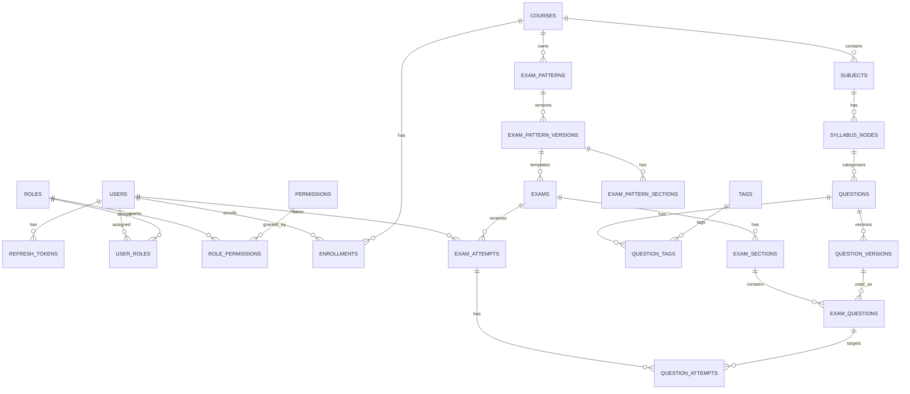

# Complete Database Schema & Entity-Relationship Diagram

This document serves as the unified reference for ALL database tables across all 14 phases of the Adaptive Examination & AI Learning Platform.

## 1. Schema Overview & Module Ownership

| Module | Table Name | Description |
|---|---|---|
| Auth | `users` | Core user accounts |
| Auth | `refresh_tokens` | JWT refresh tokens for session management |
| Roles | `roles` | RBAC roles |
| Roles | `permissions` | Granular system permissions |
| Roles | `role_permissions` | Mapping of permissions to roles |
| Roles | `user_roles` | Mapping of roles to users |
| Courses | `courses` | Top-level educational courses |
| Courses | `subjects` | Subjects belonging to courses |
| Courses | `enrollments` | Student course enrollments |
| Syllabus | `syllabus_nodes` | Hierarchical syllabus (topics, sub-topics, chapters) |
| Questions | `questions` | Base question records |
| Questions | `question_versions` | Immutable versions of questions |
| Questions | `question_tags` | Mapping of questions to tags |
| Questions | `tags` | System-wide taxonomic tags |
| Questions | `question_exam_history` | Usage history of questions in exams |
| Exam Patterns | `exam_patterns` | Templates defining exam structure |
| Exam Patterns | `exam_pattern_versions` | Immutable versions of patterns |
| Exam Patterns | `exam_pattern_sections` | Sections within an exam pattern |
| Exam Patterns | `section_rules` | Marking schemes and constraints for sections |
| Exam Patterns | `topic_distributions` | Desired topic coverage (Syllabus nodes) |
| Exam Patterns | `difficulty_distributions`| Desired difficulty coverage |
| Exams | `exams` | Concrete exam instances |
| Exams | `exam_sections` | Concrete sections for an exam instance |
| Exams | `exam_questions` | Mapping of questions to exam sections |
| Exams | `exam_question_snapshots` | Point-in-time snapshot of the question for this exam |
| Attempts | `exam_attempts` | Student attempts of an exam |
| Attempts | `question_attempts` | Responses to specific questions |
| Attempts | `answers` | Stored answers |
| Attempts | `evaluations` | Evaluated results (AI or manual) |
| Mastery | `student_mastery` | Overall mastery level of a student |
| Mastery | `student_topic_progress` | Mastery at the syllabus node level |
| Mastery | `student_weaknesses` | Identified weak areas |
| Mastery | `student_strengths` | Identified strong areas |
| Practice | `practice_papers` | AI-generated personalized practice sessions |
| Practice | `practice_questions` | Questions linked to a practice paper |
| Practice | `practice_attempts` | Student attempts for practice |
| Interviews | `interview_templates` | Configurations for AI interviews |
| Interviews | `interview_topics` | Topics covered in an interview template |
| Interviews | `interview_sessions` | Active/Completed AI interview sessions |
| Interviews | `interview_messages` | Chat history/transcript of the interview |
| Interviews | `interview_assessments` | Final evaluation report of an interview |
| Interviews | `interview_criteria_scores`| Rubric-based scoring |
| Subscriptions| `plans` | Available subscription tiers |
| Subscriptions| `subscriptions` | Active user subscriptions |
| Subscriptions| `entitlements` | Features accessible via subscription |
| Subscriptions| `plan_entitlements` | Mapping of plans to entitlements |
| Subscriptions| `ai_credits` | User credit balances for AI features |
| Subscriptions| `ai_usage` | Audit log of AI token/credit consumption |
| Subscriptions| `refund_transactions` | Refunds processed ("return money"), credit clawbacks |
| Preview | `preview_profiles` | Virtual profiles for testing content |
| Preview | `preview_courses` | Mock enrollments for preview |
| Preview | `preview_contexts` | Environment configurations for preview |
| Audit | `audit_logs` | System-wide action tracking for compliance |
| Versioning | `entity_versions` | Git-like commit history, JSON snapshots & deltas for rollbacks |

| Notifications| `notifications` | In-app/Email alerts |
| Notifications| `notification_preferences`| User settings for notifications |

---

## 2. Master ERD Overview



---

## 3. Table Definitions (Organized by Module)

### 3.1 Auth & Users Module

```text
Table: users
├── id            CUID      PK
├── email         VARCHAR   UNIQUE, NOT NULL — User's email
├── password_hash VARCHAR   NOT NULL — bcrypt hash
├── first_name    VARCHAR   NOT NULL
├── last_name     VARCHAR   NOT NULL
├── status        ENUM      ('ACTIVE', 'SUSPENDED', 'PENDING')
├── created_at    TIMESTAMP
└── updated_at    TIMESTAMP

Indexes: (email)
Relationships: has_many user_roles, refresh_tokens, enrollments, audit_logs
```

```text
Table: refresh_tokens
├── id          CUID      PK
├── user_id     CUID      FK, NOT NULL — Linked user
├── token_hash  VARCHAR   UNIQUE, NOT NULL — Hashed refresh token
├── expires_at  TIMESTAMP NOT NULL
├── revoked     BOOLEAN   DEFAULT false
├── created_at  TIMESTAMP
└── updated_at  TIMESTAMP

Indexes: (user_id), (token_hash)
Relationships: belongs_to users
```

### 3.2 Roles & Permissions Module

```text
Table: roles
├── id          CUID      PK
├── name        VARCHAR   UNIQUE, NOT NULL — 'MAIN_ADMIN', 'SUB_ADMIN', 'TEACHER', 'STUDENT'
├── description TEXT
├── is_system   BOOLEAN   DEFAULT false — Cannot be deleted if true
├── created_at  TIMESTAMP
└── updated_at  TIMESTAMP

> [!NOTE]
> **Architectural Clarification**: `PREVIEW_STUDENT` is a transient session context managed via `preview_profiles` and `preview_contexts` (Section 3.13), NOT a persisted row in the `roles` table or `user_roles` enum.

Indexes: (name)
Relationships: has_many role_permissions, user_roles
```

```text
Table: permissions
├── id          CUID      PK
├── resource    VARCHAR   NOT NULL — e.g., 'users', 'exams'
├── action      VARCHAR   NOT NULL — e.g., 'create', 'read', 'update', 'delete'
├── created_at  TIMESTAMP
└── updated_at  TIMESTAMP

Indexes: (resource, action) UNIQUE
Relationships: has_many role_permissions
```

```text
Table: role_permissions
├── id            CUID      PK
├── role_id       CUID      FK, NOT NULL
├── permission_id CUID      FK, NOT NULL
├── created_at    TIMESTAMP
└── updated_at    TIMESTAMP

Indexes: (role_id, permission_id) UNIQUE
Relationships: belongs_to roles, permissions
```

```text
Table: user_roles
├── id          CUID      PK
├── user_id     CUID      FK, NOT NULL
├── role_id     CUID      FK, NOT NULL
├── created_at  TIMESTAMP
└── updated_at  TIMESTAMP

Indexes: (user_id, role_id) UNIQUE
Relationships: belongs_to users, roles
```

### 3.3 Courses & Syllabus Module

```text
Table: courses
├── id          CUID      PK
├── name        VARCHAR   NOT NULL
├── description TEXT
├── status      ENUM      ('DRAFT', 'PUBLISHED', 'ARCHIVED')
├── created_at  TIMESTAMP
└── updated_at  TIMESTAMP

Indexes: (status)
Relationships: has_many subjects, enrollments, exam_patterns
```

```text
Table: subjects
├── id          CUID      PK
├── course_id   CUID      FK, NOT NULL
├── name        VARCHAR   NOT NULL
├── order       INTEGER   NOT NULL
├── created_at  TIMESTAMP
└── updated_at  TIMESTAMP

Indexes: (course_id)
Relationships: belongs_to courses, has_many syllabus_nodes
```

```text
Table: enrollments
├── id          CUID      PK
├── user_id     CUID      FK, NOT NULL
├── course_id   CUID      FK, NOT NULL
├── status      ENUM      ('ACTIVE', 'EXPIRED', 'DROPPED')
├── created_at  TIMESTAMP
└── updated_at  TIMESTAMP

Indexes: (user_id, course_id) UNIQUE
Relationships: belongs_to users, courses
```

```text
Table: syllabus_nodes
├── id          CUID      PK
├── subject_id  CUID      FK, NOT NULL
├── parent_id   CUID      FK, NULLABLE — Null for root nodes (Chapters)
├── name        VARCHAR   NOT NULL
├── node_type   ENUM      ('CHAPTER', 'TOPIC', 'SUBTOPIC')
├── order       INTEGER   NOT NULL
├── created_at  TIMESTAMP
└── updated_at  TIMESTAMP

Indexes: (subject_id, parent_id)
Relationships: belongs_to subjects, belongs_to syllabus_nodes (self), has_many syllabus_nodes (self)
```

### 3.4 Questions Module

```text
Table: questions
├── id                CUID      PK
├── syllabus_node_id  CUID      FK, NOT NULL
├── question_type     ENUM      ('MCQ', 'MSQ', 'NUMERICAL', 'SUBJECTIVE')
├── difficulty        ENUM      ('EASY', 'MEDIUM', 'HARD')
├── status            ENUM      ('DRAFT', 'REVIEW', 'APPROVED', 'ARCHIVED')
├── created_by        CUID      FK, NOT NULL
├── created_at        TIMESTAMP
└── updated_at        TIMESTAMP

Indexes: (syllabus_node_id), (status)
Relationships: belongs_to syllabus_nodes, has_many question_versions
```

```text
Table: question_versions
├── id                CUID      PK
├── question_id       CUID      FK, NOT NULL
├── version_num       INTEGER   NOT NULL
├── content           JSONB     NOT NULL — Question text, options, schema-dependent
├── solution          JSONB     NOT NULL — Answer key, explanation
├── language_variants JSONB     NULLABLE — Optional map of localized stems/options e.g. {"hi": {...}, "ta": {...}}
├── ai_metadata       JSONB     NULLABLE — AI review data
├── created_by        CUID      FK, NOT NULL
├── created_at        TIMESTAMP
└── updated_at        TIMESTAMP

Indexes: (question_id, version_num) UNIQUE
Relationships: belongs_to questions
```

### 3.5 Exam Patterns Module

```text
Table: exam_patterns
├── id          CUID      PK
├── course_id   CUID      FK, NOT NULL
├── name        VARCHAR   NOT NULL
├── status      ENUM      ('DRAFT', 'ACTIVE', 'ARCHIVED')
├── created_at  TIMESTAMP
└── updated_at  TIMESTAMP

Indexes: (course_id)
Relationships: belongs_to courses, has_many exam_pattern_versions
```

```text
Table: exam_pattern_versions
├── id               CUID      PK
├── exam_pattern_id  CUID      FK, NOT NULL
├── version_num      INTEGER   NOT NULL
├── total_duration   INTEGER   NOT NULL — in minutes
├── instructions     TEXT
├── created_at       TIMESTAMP
└── updated_at       TIMESTAMP

Indexes: (exam_pattern_id, version_num) UNIQUE
Relationships: belongs_to exam_patterns, has_many exam_pattern_sections
```

### 3.6 Exams & Attempts Module

```text
Table: exams
├── id                      CUID      PK
├── exam_pattern_version_id CUID      FK, NOT NULL
├── name                    VARCHAR   NOT NULL
├── scheduled_start         TIMESTAMP NULLABLE
├── scheduled_end           TIMESTAMP NULLABLE
├── status                  ENUM      ('DRAFT', 'PUBLISHED', 'ONGOING', 'COMPLETED')
├── created_at              TIMESTAMP
└── updated_at              TIMESTAMP

Indexes: (status), (scheduled_start)
Relationships: belongs_to exam_pattern_versions, has_many exam_sections, exam_attempts
```

```text
Table: exam_attempts
├── id            CUID      PK
├── exam_id       CUID      FK, NOT NULL
├── user_id       CUID      FK, NOT NULL
├── shuffle_seed  VARCHAR   NOT NULL — Seed for deterministic question & option shuffling
├── start_time    TIMESTAMP NOT NULL
├── end_time      TIMESTAMP NULLABLE
├── status        ENUM      ('IN_PROGRESS', 'SUBMITTED', 'EVALUATED')
├── final_score   FLOAT     NULLABLE
├── created_at    TIMESTAMP
└── updated_at    TIMESTAMP

> [!NOTE]
> **Presented Order Reconstruction**: `shuffle_seed` + canonical question/option indices together deterministically generate the attempt-specific presented order for student UI and post-exam review/audit.

Indexes: (exam_id, user_id), (status)
Relationships: belongs_to exams, users, has_many question_attempts
```

### 3.7 Entity Versioning Engine Module (`@repo/versioning-engine`)

```text
Table: entity_versions
├── id                CUID      PK
├── entity_type       VARCHAR   NOT NULL — 'USER', 'QUESTION', 'EXAM_PATTERN', 'EXAM', 'COURSE', 'SUBJECT', 'SYLLABUS_NODE'
├── entity_id         CUID      NOT NULL — Target entity primary key
├── version_num       INTEGER   NOT NULL — 1, 2, 3...
├── parent_version_id CUID      FK, NULLABLE — Pointer to previous version commit (DAG chain)
├── snapshot          JSONB     NOT NULL — Complete immutable entity state snapshot
├── delta             JSONB     NULLABLE — RFC 6902 JSON patch diff against parent
├── action_type       ENUM      ('CREATE', 'UPDATE', 'DELETE', 'STATUS_CHANGE', 'REVERT')
├── actor_user_id     CUID      FK, NOT NULL — Admin/User who committed the version
├── commit_message    TEXT      NULLABLE — Reason or context for commit
├── created_at        TIMESTAMP
└── updated_at        TIMESTAMP

Indexes: (entity_type, entity_id, version_num) UNIQUE, (parent_version_id), (actor_user_id)
Relationships: belongs_to users (actor_user_id), belongs_to entity_versions (parent_version_id self)
```

### 3.8 Audit System Module

```text
Table: audit_logs
├── id               CUID      PK
├── actor_user_id    CUID      FK, NOT NULL — Admin/User triggering the action
├── action           VARCHAR   NOT NULL — e.g., 'user.profile_reverted', 'billing.refund_processed', 'result.flagged_by_student'
├── resource         VARCHAR   NOT NULL — Target resource/table
├── resource_id      CUID      NULLABLE — Target resource ID
├── payload_snapshot JSONB     NULLABLE — Sanitized action payload/diff
├── ip_address       VARCHAR   NULLABLE — Client IPv4/IPv6
├── user_agent       TEXT      NULLABLE — User-agent string
├── mode             ENUM      ('DIRECT', 'PREVIEW', 'IMPERSONATE') DEFAULT 'DIRECT'
├── impersonator_id  CUID      FK, NULLABLE — Real admin ID if mode = IMPERSONATE
├── created_at       TIMESTAMP

> [!NOTE]
> **Student Result Flags**: Student score flags ("Report Score" / "Flag for Review") write directly into `audit_logs` with `action = 'result.flagged_by_student'`, `resource = 'exam_attempts'`, `resource_id = <attempt_id>`. No dedicated dispute or appeal state machine table is required.

Indexes: (actor_user_id), (action), (resource, resource_id), (created_at)
Relationships: belongs_to users (actor_user_id), belongs_to users (impersonator_id)
```

### 3.9 Student Analytics & Mastery Engine Module

```text
Table: student_mastery
├── id                        CUID      PK
├── user_id                   CUID      FK, UNIQUE, NOT NULL
├── overall_proficiency       FLOAT     NOT NULL DEFAULT 0.0 — Percentage score (0.0 to 100.0)
├── total_exams_taken         INTEGER   NOT NULL DEFAULT 0
├── total_questions_attempted INTEGER   NOT NULL DEFAULT 0
├── created_at                TIMESTAMP
└── updated_at                TIMESTAMP

Indexes: (user_id) UNIQUE
Relationships: belongs_to users, has_many student_topic_progress
```

```text
Table: student_topic_progress
├── id                CUID      PK
├── user_id           CUID      FK, NOT NULL
├── syllabus_node_id  CUID      FK, NOT NULL — Linked Topic or Concept node
├── proficiency_score FLOAT     NOT NULL DEFAULT 0.0 — Weighted score
├── attempts_count    INTEGER   NOT NULL DEFAULT 0
├── correct_count     INTEGER   NOT NULL DEFAULT 0
├── status            ENUM      ('WEAK', 'NEEDS_PRACTICE', 'PROFICIENT', 'MASTERED')
├── last_evaluated_at TIMESTAMP
├── created_at        TIMESTAMP
└── updated_at        TIMESTAMP

Indexes: (user_id, syllabus_node_id) UNIQUE, (status)
Relationships: belongs_to users, belongs_to syllabus_nodes
```

```text
Table: student_weaknesses
├── id                CUID      PK
├── user_id           CUID      FK, NOT NULL
├── syllabus_node_id  CUID      FK, NOT NULL
├── error_rate        FLOAT     NOT NULL — Error percentage (0.0 to 1.0)
├── severity          ENUM      ('CRITICAL', 'MODERATE', 'MINOR')
├── is_active         BOOLEAN   DEFAULT true
├── created_at        TIMESTAMP
└── updated_at        TIMESTAMP

Indexes: (user_id, syllabus_node_id) UNIQUE, (is_active)
Relationships: belongs_to users, belongs_to syllabus_nodes
```

```text
Table: student_strengths
├── id                CUID      PK
├── user_id           CUID      FK, NOT NULL
├── syllabus_node_id  CUID      FK, NOT NULL
├── mastery_score     FLOAT     NOT NULL
├── created_at        TIMESTAMP
└── updated_at        TIMESTAMP

Indexes: (user_id, syllabus_node_id) UNIQUE
Relationships: belongs_to users, belongs_to syllabus_nodes
```

### 3.10 Personalized Practice Engine Module

```text
Table: practice_papers
├── id              CUID      PK
├── user_id         CUID      FK, NOT NULL
├── title           VARCHAR   NOT NULL
├── total_questions INTEGER   NOT NULL
├── status          ENUM      ('GENERATED', 'IN_PROGRESS', 'COMPLETED')
├── target_node_ids JSONB     NOT NULL — Target syllabus node IDs included
├── created_at      TIMESTAMP
└── updated_at      TIMESTAMP

Indexes: (user_id), (status)
Relationships: belongs_to users, has_many practice_questions, practice_attempts
```

```text
Table: practice_questions
├── id                CUID      PK
├── practice_paper_id CUID      FK, NOT NULL
├── question_id       CUID      FK, NOT NULL
├── version_num       INTEGER   NOT NULL
├── order             INTEGER   NOT NULL
├── created_at        TIMESTAMP
└── updated_at        TIMESTAMP

Indexes: (practice_paper_id, question_id) UNIQUE
Relationships: belongs_to practice_papers, belongs_to questions
```

```text
Table: practice_attempts
├── id                 CUID      PK
├── practice_paper_id  CUID      FK, NOT NULL
├── user_id            CUID      FK, NOT NULL
├── score              FLOAT     NULLABLE
├── accuracy_percentage FLOAT     NULLABLE
├── completed_at       TIMESTAMP NULLABLE
├── created_at         TIMESTAMP
└── updated_at         TIMESTAMP

Indexes: (practice_paper_id, user_id)
Relationships: belongs_to practice_papers, belongs_to users
```

### 3.11 AI Interview System Module

```text
Table: interview_templates
├── id            CUID      PK
├── title         VARCHAR   NOT NULL
├── role_or_topic VARCHAR   NOT NULL
├── difficulty    ENUM      ('ENTRY', 'INTERMEDIATE', 'ADVANCED')
├── duration_mins INTEGER   NOT NULL DEFAULT 15
├── created_by    CUID      FK, NOT NULL
├── created_at    TIMESTAMP
└── updated_at    TIMESTAMP

Indexes: (difficulty)
Relationships: belongs_to users (created_by), has_many interview_topics, interview_sessions
```

```text
Table: interview_topics
├── id               CUID      PK
├── template_id      CUID      FK, NOT NULL
├── syllabus_node_id CUID      FK, NULLABLE
├── topic_name       VARCHAR   NOT NULL
├── order            INTEGER   NOT NULL
├── created_at       TIMESTAMP
└── updated_at       TIMESTAMP

Indexes: (template_id)
Relationships: belongs_to interview_templates, belongs_to syllabus_nodes
```

```text
Table: interview_sessions
├── id          CUID      PK
├── template_id CUID      FK, NOT NULL
├── user_id     CUID      FK, NOT NULL
├── status      ENUM      ('INITIATED', 'IN_PROGRESS', 'COMPLETED', 'ABORTED')
├── start_time  TIMESTAMP NOT NULL
├── end_time    TIMESTAMP NULLABLE
├── created_at  TIMESTAMP
└── updated_at  TIMESTAMP

Indexes: (template_id, user_id), (status)
Relationships: belongs_to interview_templates, belongs_to users, has_many interview_messages, has_one interview_assessments
```

```text
Table: interview_messages
├── id          CUID      PK
├── session_id  CUID      FK, NOT NULL
├── sender      ENUM      ('SYSTEM', 'AI', 'STUDENT')
├── content     TEXT      NOT NULL
├── audio_url   VARCHAR   NULLABLE — Speech audio URL
├── latency_ms  INTEGER   NULLABLE
├── created_at  TIMESTAMP

Indexes: (session_id, created_at)
Relationships: belongs_to interview_sessions
```

```text
Table: interview_assessments
├── id                  CUID      PK
├── session_id          CUID      FK, UNIQUE, NOT NULL
├── overall_score       FLOAT     NOT NULL
├── technical_score     FLOAT     NOT NULL
├── communication_score FLOAT     NOT NULL
├── feedback_summary    TEXT      NOT NULL
├── strengths           JSONB     NOT NULL
├── improvements        JSONB     NOT NULL
├── created_at          TIMESTAMP
└── updated_at          TIMESTAMP

Indexes: (session_id) UNIQUE
Relationships: belongs_to interview_sessions, has_many interview_criteria_scores
```

```text
Table: interview_criteria_scores
├── id            CUID      PK
├── assessment_id CUID      FK, NOT NULL
├── criterion_name VARCHAR  NOT NULL
├── score         FLOAT     NOT NULL
├── max_score     FLOAT     NOT NULL
├── remarks       TEXT
├── created_at    TIMESTAMP
└── updated_at    TIMESTAMP

Indexes: (assessment_id)
Relationships: belongs_to interview_assessments
```

### 3.12 Subscription, Entitlements & Billing Module (`BillingAdapter`)

```text
Table: plans
├── id                   CUID      PK
├── name                 VARCHAR   UNIQUE, NOT NULL — e.g., 'Free Tier', 'Premium Academic', 'Premium Plus AI'
├── tier                 ENUM      ('FREE', 'PREMIUM', 'PREMIUM_PLUS')
├── price_monthly        FLOAT     NOT NULL DEFAULT 0.0
├── price_yearly         FLOAT     NOT NULL DEFAULT 0.0
├── included_ai_credits  INTEGER   NOT NULL DEFAULT 0 — Daily/Monthly quota
├── is_active            BOOLEAN   DEFAULT true
├── created_at           TIMESTAMP
└── updated_at           TIMESTAMP

Indexes: (name), (tier)
Relationships: has_many subscriptions, plan_entitlements
```

```text
Table: subscriptions
├── id                   CUID      PK
├── user_id              CUID      FK, NOT NULL
├── plan_id              CUID      FK, NOT NULL
├── status               ENUM      ('ACTIVE', 'CANCELLED', 'EXPIRED', 'PAST_DUE')
├── current_period_start TIMESTAMP NOT NULL
├── current_period_end   TIMESTAMP NOT NULL
├── external_sub_id      VARCHAR   NULLABLE — Gateway subscription reference
├── created_at           TIMESTAMP
└── updated_at           TIMESTAMP

Indexes: (user_id), (plan_id), (status)
Relationships: belongs_to users, belongs_to plans
```

```text
Table: entitlements
├── id          CUID      PK
├── key         VARCHAR   UNIQUE, NOT NULL — e.g., 'feature.ai_interview', 'limit.exams_per_month'
├── name        VARCHAR   NOT NULL
├── description TEXT
├── created_at  TIMESTAMP
└── updated_at  TIMESTAMP

Indexes: (key) UNIQUE
Relationships: has_many plan_entitlements
```

```text
Table: plan_entitlements
├── id             CUID      PK
├── plan_id        CUID      FK, NOT NULL
├── entitlement_id CUID      FK, NOT NULL
├── limit_value    VARCHAR   NULLABLE — e.g., '10', 'UNLIMITED', 'true'
├── created_at     TIMESTAMP
└── updated_at     TIMESTAMP

Indexes: (plan_id, entitlement_id) UNIQUE
Relationships: belongs_to plans, belongs_to entitlements
```

```text
Table: ai_credits
├── id                     CUID      PK
├── user_id                CUID      FK, UNIQUE, NOT NULL
├── purchased_balance      INTEGER   NOT NULL DEFAULT 0
├── daily_included_balance INTEGER   NOT NULL DEFAULT 0
├── last_reset_date        DATE      NOT NULL — UTC date of last daily reset
├── created_at             TIMESTAMP
└── updated_at             TIMESTAMP

Indexes: (user_id) UNIQUE
Relationships: belongs_to users
```

```text
Table: ai_usage
├── id          CUID      PK
├── user_id     CUID      FK, NOT NULL
├── feature     VARCHAR   NOT NULL — 'ai_interview', 'question_modify'
├── credit_type ENUM      ('INCLUDED', 'PURCHASED')
├── status      ENUM      ('CONSUMED', 'REFUNDED')
├── created_at  TIMESTAMP

Indexes: (user_id), (feature), (created_at)
Relationships: belongs_to users
```

```text
Table: refund_transactions
├── id                     CUID      PK
├── user_id                CUID      FK, NOT NULL — Account affected
├── actor_user_id          CUID      FK, NOT NULL — Admin approving refund
├── gateway                VARCHAR   NOT NULL — 'Razorpay', 'Stripe', 'PreviewSim'
├── gateway_payment_id     VARCHAR   NOT NULL — Original payment ID
├── gateway_refund_id      VARCHAR   NOT NULL — Gateway refund confirmation ID
├── refund_amount          FLOAT     NOT NULL
├── is_partial             BOOLEAN   DEFAULT false
├── clawback_credits_count INTEGER   NOT NULL DEFAULT 0
├── status                 ENUM      ('SUCCESS', 'PENDING', 'FAILED')
├── reason                 TEXT      NOT NULL
├── created_at             TIMESTAMP
└── updated_at             TIMESTAMP

Indexes: (user_id), (actor_user_id), (gateway_payment_id)
Relationships: belongs_to users (user_id), belongs_to users (actor_user_id)
```

### 3.13 Preview System Module Persona & Contexts

> [!NOTE]
> **Architectural Clarification**: `PREVIEW_STUDENT` is a transient session context managed via `preview_profiles` and `preview_contexts`, NOT a persisted row in the `roles` table or `user_roles` enum.

```text
Table: preview_profiles
├── id             CUID      PK
├── owner_user_id  CUID      FK, NOT NULL — Staff member's real user ID
├── simulated_role ENUM      ('STUDENT') DEFAULT 'STUDENT'
├── simulated_tier ENUM      ('FREE', 'PREMIUM', 'PREMIUM_PLUS') DEFAULT 'FREE'
├── display_name   VARCHAR   NOT NULL DEFAULT 'Preview Student Persona'
├── created_at     TIMESTAMP
└── updated_at     TIMESTAMP

Indexes: (owner_user_id)
Relationships: belongs_to users (owner_user_id), has_many preview_courses, preview_contexts
```

```text
Table: preview_courses
├── id                 CUID      PK
├── preview_profile_id CUID      FK, NOT NULL
├── course_id          CUID      FK, NOT NULL
├── created_at         TIMESTAMP
└── updated_at         TIMESTAMP

Indexes: (preview_profile_id, course_id) UNIQUE
Relationships: belongs_to preview_profiles, belongs_to courses
```

```text
Table: preview_contexts
├── id                 CUID      PK
├── preview_profile_id CUID      FK, NOT NULL
├── active_exam_id     CUID      FK, NULLABLE
├── active_practice_id CUID      FK, NULLABLE
├── state_data         JSONB     NULLABLE — Transient session variables
├── created_at         TIMESTAMP
└── updated_at         TIMESTAMP

Indexes: (preview_profile_id)
Relationships: belongs_to preview_profiles
```

### 3.14 Notifications Module

```text
Table: notifications
├── id         CUID      PK
├── user_id    CUID      FK, NOT NULL
├── title      VARCHAR   NOT NULL
├── message    TEXT      NOT NULL
├── type       ENUM      ('SYSTEM', 'EXAM', 'PRACTICE', 'BILLING')
├── is_read    BOOLEAN   DEFAULT false
├── created_at TIMESTAMP

Indexes: (user_id, is_read), (created_at)
Relationships: belongs_to users
```

```text
Table: notification_preferences
├── id             CUID      PK
├── user_id        CUID      FK, UNIQUE, NOT NULL
├── email_enabled  BOOLEAN   DEFAULT true
├── in_app_enabled BOOLEAN   DEFAULT true
├── created_at     TIMESTAMP
└── updated_at     TIMESTAMP

Indexes: (user_id) UNIQUE
Relationships: belongs_to users
```

### 3.15 Localization & User Preferences Module

```text
Table: languages
├── id          CUID      PK
├── code        VARCHAR   UNIQUE, NOT NULL — e.g. "hi", "en", "ta"
├── name        VARCHAR   NOT NULL — e.g. "Hindi"
├── native_name VARCHAR   NOT NULL — e.g. "हिन्दी"
├── is_rtl      BOOLEAN   DEFAULT false
├── is_active   BOOLEAN   DEFAULT true
├── created_at  TIMESTAMP
└── updated_at  TIMESTAMP

Indexes: (code) UNIQUE
Relationships: has_many translations
```

```text
Table: translation_keys
├── id           CUID      PK
├── namespace    VARCHAR   NOT NULL — e.g. "auth", "exam", "dashboard"
├── key          VARCHAR   NOT NULL — e.g. "start_exam_button"
├── default_text TEXT      NOT NULL — English fallback text
├── description  TEXT
└── created_at   TIMESTAMP

Indexes: (namespace, key) UNIQUE
Relationships: has_many translations
```

```text
Table: translations
├── id              CUID    PK
├── key_id          CUID    FK, NOT NULL — Linked translation_keys.id
├── language_id     CUID    FK, NOT NULL — Linked languages.id
├── translated_text TEXT    NOT NULL
├── is_verified     BOOLEAN DEFAULT true
├── created_at      TIMESTAMP
└── updated_at      TIMESTAMP

Indexes: (key_id, language_id) UNIQUE
Relationships: belongs_to translation_keys, belongs_to languages
```

```text
Table: user_preferences
├── user_id             CUID    PK, FK, NOT NULL — Linked users.id
├── theme_mode          ENUM    ('LIGHT', 'GRAY', 'DARK') DEFAULT 'LIGHT'
├── preferred_lang_code VARCHAR DEFAULT 'en'
└── updated_at          TIMESTAMP

Indexes: (user_id) UNIQUE
Relationships: belongs_to users
```

---

## 4. Migration Strategy Notes

**Rule: Additive Changes Only**
In an API-first platform where legacy mobile clients or distributed systems may rely on older schema versions, destructive migrations (dropping columns/tables, changing types) are prohibited.

1. **Adding Columns**: Always nullable or with a default value.
2. **Renaming Columns**: Create the new column, dual-write to both, migrate data, change reads to new column, deprecate old column (do not drop).
3. **Data Types**: If a type must change (e.g., INT to BIGINT), create a new column `new_col_name`, backfill, and transition application logic.
4. **Prisma ORM**: All changes must be explicitly generated via `pnpm db:migrate` creating timestamped SQL files in `prisma/migrations`. Never edit generated migration files directly. Use `prisma generate` to update the client.

