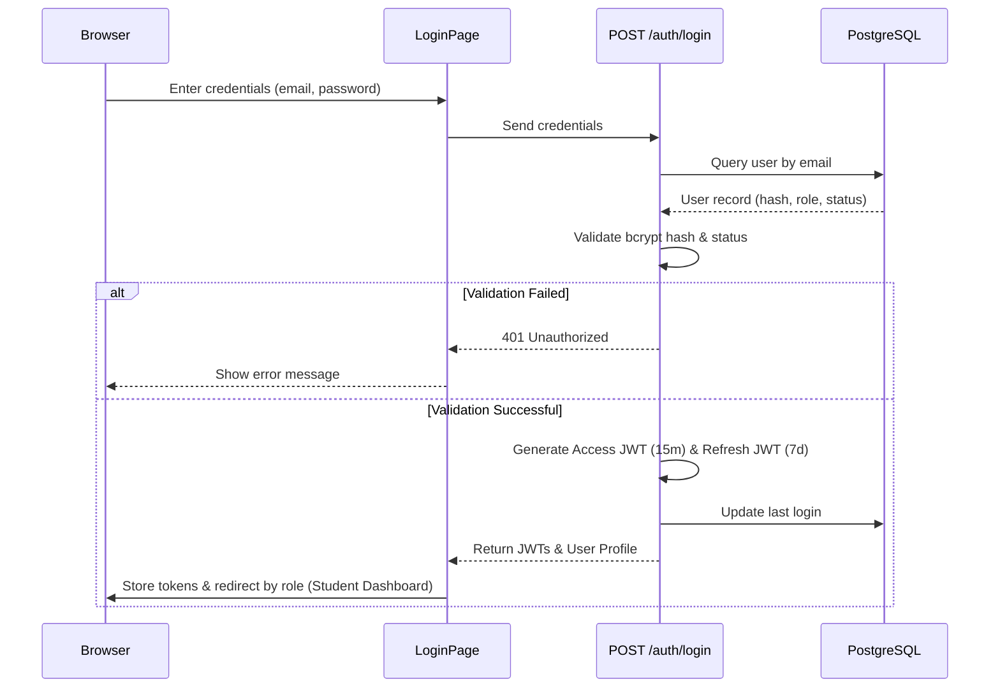
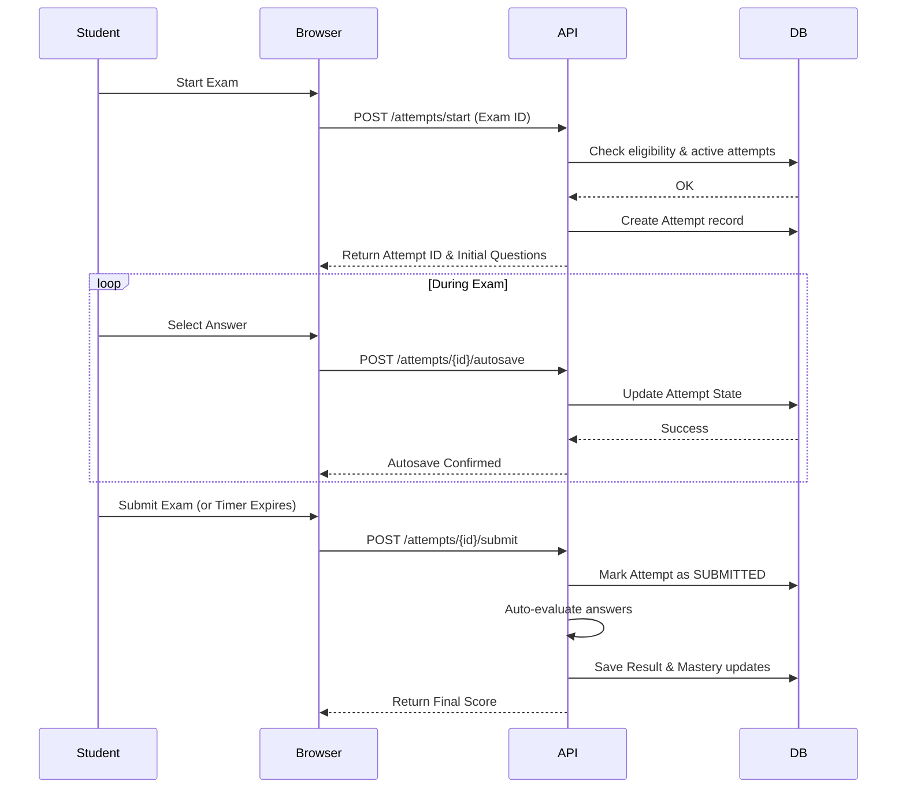
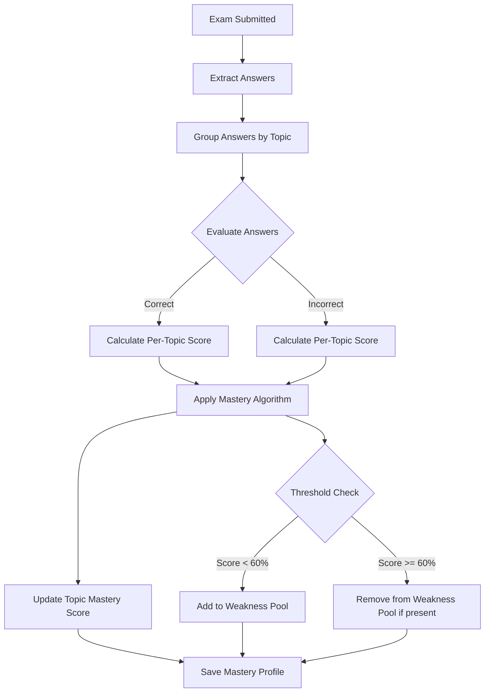
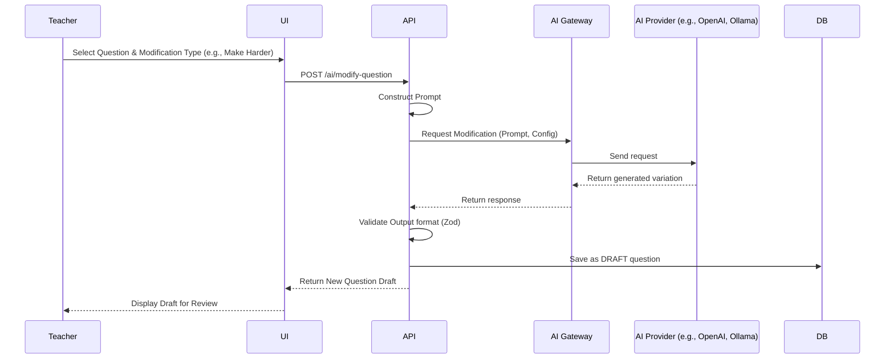
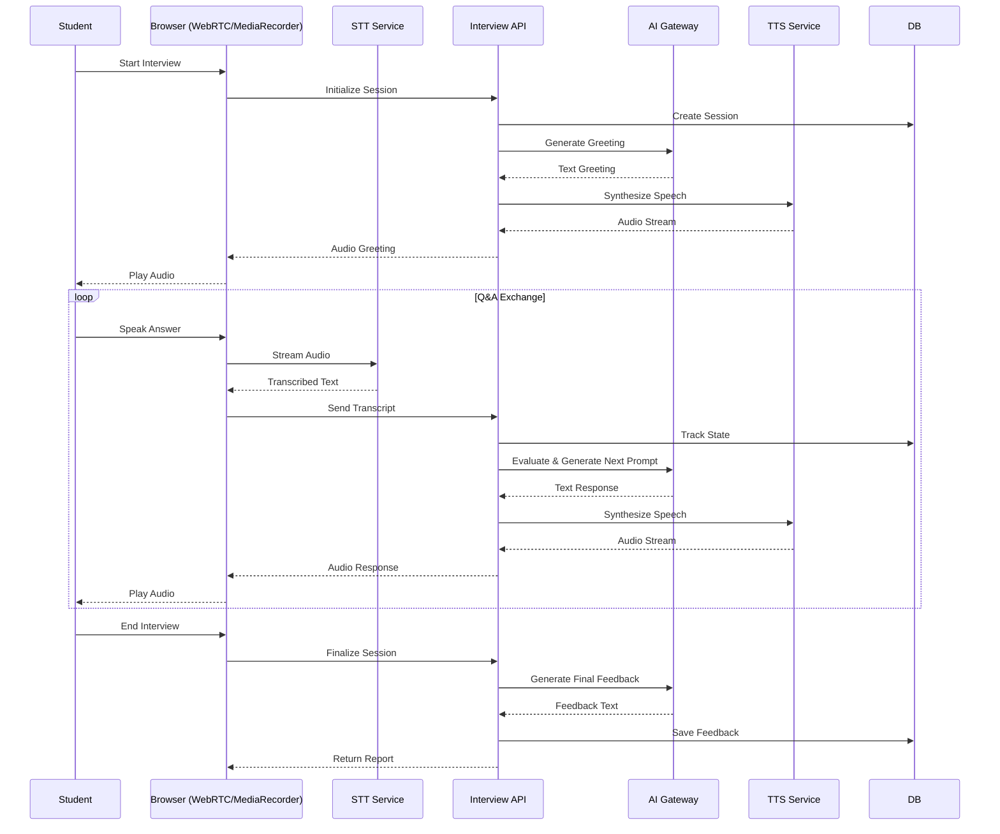
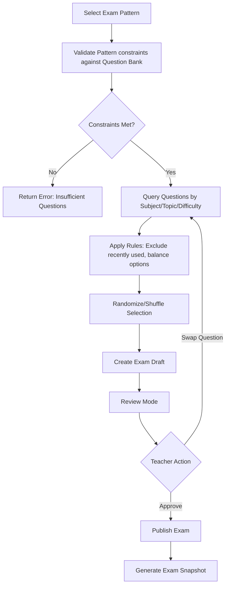
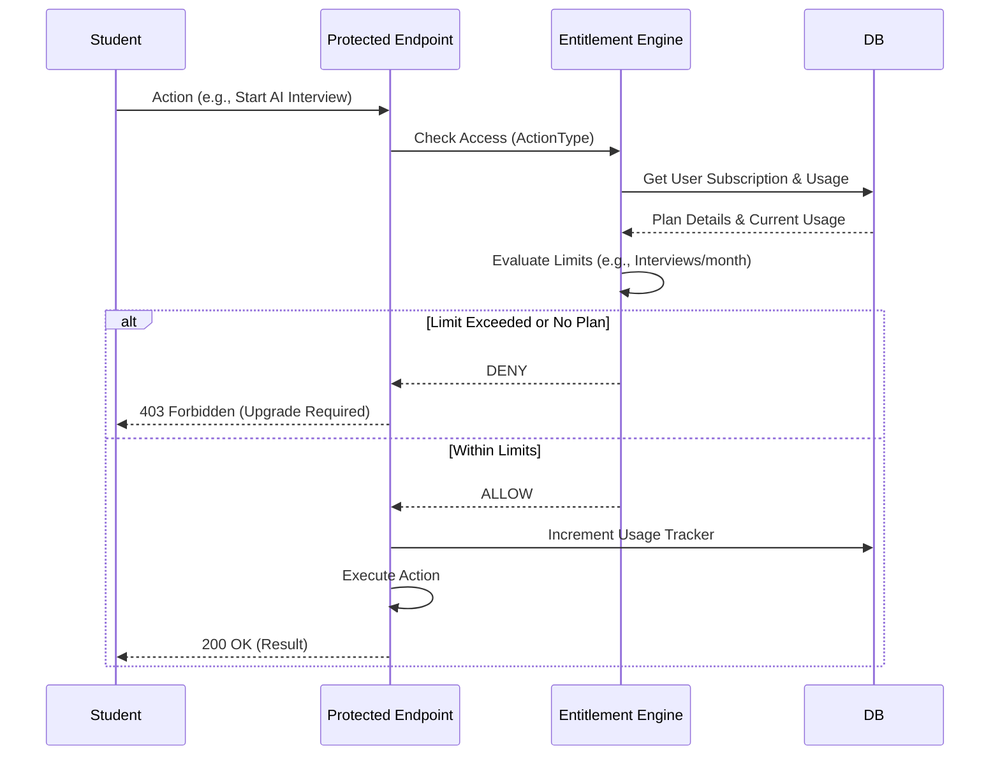
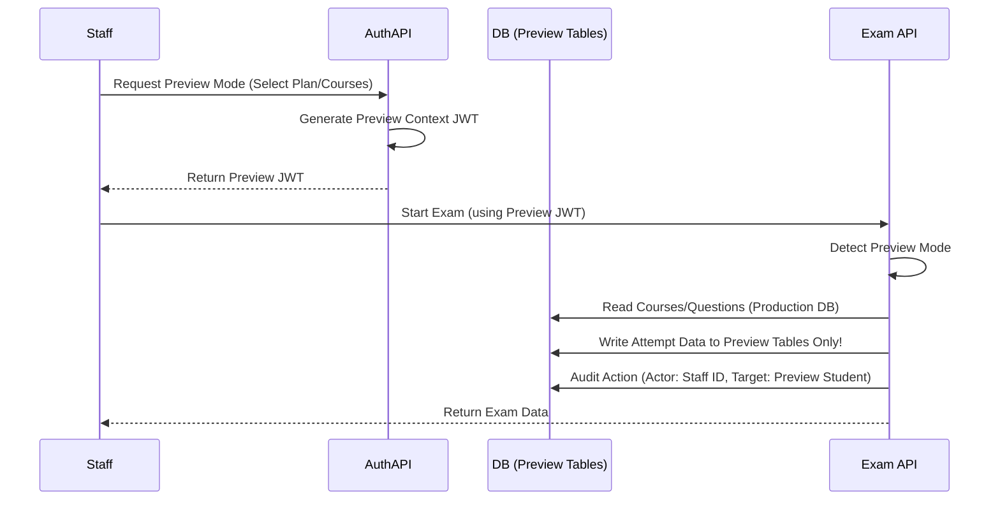
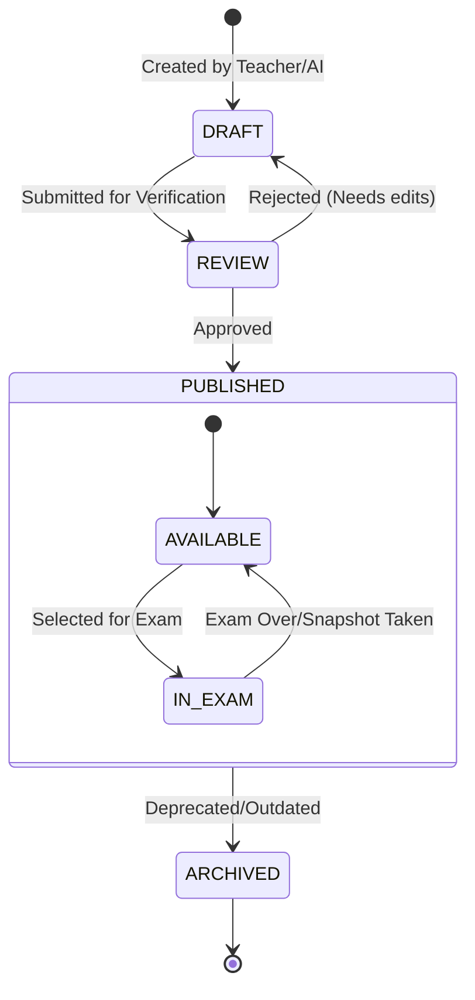
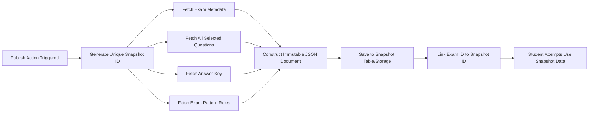

# Data Flow Diagrams

This document visualizes the critical workflows and data flows within the Adaptive Examination & AI Learning Platform using Mermaid diagrams.

## 1. Student Login Flow

**Description**: The authentication process for students, including credentials validation, JWT issuance, and role-based redirection.

## 2. Exam Taking Flow

**Description**: The process of taking an exam, from loading the exam to final submission and auto-evaluation.

## 3. Mastery Calculation Flow

**Description**: How the system calculates and updates a student's topic mastery and weakness pool based on exam results.

## 4. AI Question Modification

**Description**: Process of modifying a question using the AI Gateway, supporting multiple providers.

## 5. AI Interview Session

**Description**: An interactive AI-driven interview session for practice, involving text-to-speech and speech-to-text.

## 6. Exam Generation Flow

**Description**: Automatic generation of an exam based on a predefined pattern.

## 7. Subscription Check Flow

**Description**: Entitlement checking process to ensure users have active subscriptions for premium features.

## 8. Preview Student Flow

**Description**: Staff masquerading as a student to preview content, with strict isolation and auditing.

## 9. Question Lifecycle

**Description**: State machine and lifecycle of a question item within the bank.

## 10. Published Exam Snapshot

**Description**: Creating immutable snapshots of exams to preserve integrity even if underlying questions change.

