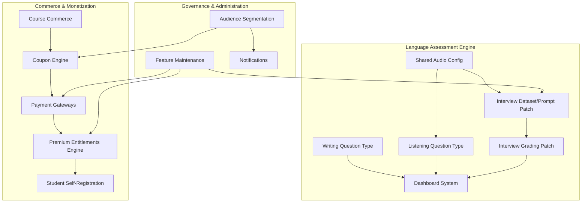

# ExamOS V2 — Master Feature & Patch Specification

## Vision
ExamOS V2 expands the platform from an adaptive examination engine into a comprehensive, extensible online assessment and language learning platform. V2 unifies standard academic/competitive examinations, conversational AI oral viva/interviews, structured writing assessments, listening comprehension, vocabulary retention engines, course-level commerce with multi-currency pricing, multi-gateway billing, centralized feature maintenance controls, dynamic premium entitlements, and customizable visual themes under a single, cohesive architecture.

---

## Feature & Patch Index

| Ref | Deliverable Name | Category | Type | Priority | Specification Document |
| :--- | :--- | :--- | :--- | :--- | :--- |
| **A** | Listening Question Type | Language Examination | New Feature | **P1** | [`features/listening-question-type.md`](file:///D:/Download/Company/Software/Test%20os/Exam/docs/v2/features/listening-question-type.md) |
| **B** | Writing Question Type | Language Examination | New Feature | **P1** | [`features/writing-question-type.md`](file:///D:/Download/Company/Software/Test%20os/Exam/docs/v2/features/writing-question-type.md) |
| **C** | Interview System Knowledge/Prompt Separation | Language Examination / AI | Patch | **P0** | [`patches/interview-system.md`](file:///D:/Download/Company/Software/Test%20os/Exam/docs/v2/patches/interview-system.md) |
| **D** | Interview Grading & Longitudinal Analysis | Language Examination / AI | Patch | **P0** | [`patches/interview-grading-analysis.md`](file:///D:/Download/Company/Software/Test%20os/Exam/docs/v2/patches/interview-grading-analysis.md) |
| **E** | Vocabulary Practice & Spaced Repetition | Learning & Retention | New Feature | **P2** | [`features/vocabulary-practice.md`](file:///D:/Download/Company/Software/Test%20os/Exam/docs/v2/features/vocabulary-practice.md) |
| **F** | Course Creation & Commerce | Commerce & Products | New Feature | **P1** | [`features/course-commerce.md`](file:///D:/Download/Company/Software/Test%20os/Exam/docs/v2/features/course-commerce.md) |
| **G** | Promotional Coupon Engine | Commerce & Marketing | New Feature | **P1** | [`features/coupon-system.md`](file:///D:/Download/Company/Software/Test%20os/Exam/docs/v2/features/coupon-system.md) |
| **H** | Real Payment Gateways (Razorpay / Stripe) | Commerce & Payments | Patch | **P0** | [`features/payment-gateways.md`](file:///D:/Download/Company/Software/Test%20os/Exam/docs/v2/features/payment-gateways.md) |
| **I** | Student Self-Registration & Profile | User & Authentication | New Feature | **P1** | [`features/student-auth-profile.md`](file:///D:/Download/Company/Software/Test%20os/Exam/docs/v2/features/student-auth-profile.md) |
| **J** | In-App Notification Center | Communication | New Feature | **P2** | [`features/notifications.md`](file:///D:/Download/Company/Software/Test%20os/Exam/docs/v2/features/notifications.md) |
| **K** | Role-Based Interactive Dashboards | Examination & Analytics | Patch | **P1** | [`features/dashboard-system.md`](file:///D:/Download/Company/Software/Test%20os/Exam/docs/v2/features/dashboard-system.md) |
| **L** | Audience & Contact Segmentation | Marketing & Audience | New Feature | **P2** | [`features/audience-segmentation.md`](file:///D:/Download/Company/Software/Test%20os/Exam/docs/v2/features/audience-segmentation.md) |
| **M** | Platform Themes & Visual Customization | Platform Administration | New Feature | **P2** | [`features/platform-themes.md`](file:///D:/Download/Company/Software/Test%20os/Exam/docs/v2/features/platform-themes.md) |
| **N** | Feature-Level & Global Maintenance Engine | Platform Administration | New Feature | **P1** | [`features/feature-maintenance.md`](file:///D:/Download/Company/Software/Test%20os/Exam/docs/v2/features/feature-maintenance.md) |
| **O** | Premium Entitlements & Feature Registry | Maintenance & Entitlements | Patch | **P0** | [`features/premium-entitlements.md`](file:///D:/Download/Company/Software/Test%20os/Exam/docs/v2/features/premium-entitlements.md) |
| **P** | Schema-Validated JSON Import & Export | Import & Export | New Feature | **P2** | [`features/json-import-export.md`](file:///D:/Download/Company/Software/Test%20os/Exam/docs/v2/features/json-import-export.md) |
| **Q** | Exam Player Theme Builder | Future Exam UI | New Feature | **P2** | [`features/exam-theme-builder.md`](file:///D:/Download/Company/Software/Test%20os/Exam/docs/v2/features/exam-theme-builder.md) |
| **R** | In-App Help & Onboarding Tours | Help & Onboarding | New Feature | **P2** | [`features/help-onboarding.md`](file:///D:/Download/Company/Software/Test%20os/Exam/docs/v2/features/help-onboarding.md) |

---

## Feature Categories & Status Summary

### 1. Language Examination
- **Listening Question Type** (`features/listening-question-type.md`): Multi-format audio comprehension with shared voice configuration and immutable snapshot audio. (*New / P1*)
- **Writing Question Type** (`features/writing-question-type.md`): Long-form essay assessment with word counter, auto-save, and multi-category AI rubric diagnostics. (*New / P1*)
- **Interview System Patch** (`patches/interview-system.md`): Separation of Knowledge Dataset from Behavioral Prompt instructions in oral viva. (*Patch / P0*)
- **Interview Grading & Analysis Patch** (`patches/interview-grading-analysis.md`): Evidence-grounded quotation feedback, universal rubric normalization, and historical longitudinal score comparison. (*Patch / P0*)

### 2. Learning & Retention
- **Vocabulary Practice** (`features/vocabulary-practice.md`): Spaced repetition, 6 active practice modes, and student vocabulary mastery tracking. (*New / P2*)

### 3. Commerce & Payments
- **Course Creation + Commerce** (`features/course-commerce.md`): Course-as-a-Product model with explicit multi-currency pricing and flexible access durations. (*New / P1*)
- **Promotional Coupon Engine** (`features/coupon-system.md`): Scoped percentage/fixed discount rules with usage limits and audience targeting. (*New / P1*)
- **Real Payment Gateways** (`features/payment-gateways.md`): Razorpay and Stripe adapter implementations behind existing `BillingAdapter` interface with webhook signature verification. (*Patch / P0*)

### 4. User & Authentication
- **Student Auth & Profile** (`features/student-auth-profile.md`): Friction-free student self-registration, password change re-authentication, and communication preference controls. (*New / P1*)

### 5. Communication
- **In-App Notification Center** (`features/notifications.md`): Event-driven notifications with deep links, unread counts, and multi-channel readiness. (*New / P2*)

### 6. Examination & Analytics
- **Role-Based Interactive Dashboards** (`features/dashboard-system.md`): Replacing static welcome screen with actionable widgets for Students, Teachers, and Admins. (*Patch / P1*)

### 7. Marketing & Audience
- **Audience & Contact Segmentation** (`features/audience-segmentation.md`): Multi-condition student cohort builder with privacy safeguards and export audit logging. (*New / P2*)

### 8. Platform Administration & Maintenance
- **Platform Themes** (`features/platform-themes.md`): Accent palettes, high-contrast accessibility mode, and typography scaling. (*New / P2*)
- **Feature-Level & Global Maintenance Engine** (`features/feature-maintenance.md`): Dynamic runtime feature switches and global maintenance mode with staff bypass. (*New / P1*)
- **Premium Entitlements & Feature Registry** (`features/premium-entitlements.md`): Centralized feature registry, promotional date-based access, and standardized blur/teaser guardrails. (*Patch / P0*)

### 9. Import & Export
- **Schema-Validated JSON Import & Export** (`features/json-import-export.md`): Versioned, validated import/export for Questions, Courses, and Blueprints with dry-run previews. (*New / P2*)

### 10. Future Exam UI
- **Exam Player Theme Builder** (`features/exam-theme-builder.md`): Visual exam layout, timer positioning, and color customization per examination. (*New / P2*)

### 11. Help & Onboarding
- **Help & Onboarding System** (`features/help-onboarding.md`): Contextual help drawer, step-by-step role-based product tours, and keyboard shortcut guides. (*New / P2*)

---

## Priority Classification

- **Priority 0 (Critical Foundations & Architectural Patches):**
  - `patches/interview-system.md` (Dataset vs Prompt separation)
  - `patches/interview-grading-analysis.md` (Evidence quotes & attempt comparison)
  - `features/payment-gateways.md` (Real Razorpay/Stripe adapters behind interface)
  - `features/premium-entitlements.md` (Centralized Feature Registry & promo dates)

- **Priority 1 (Core Capabilities & Commerce Engine):**
  - `features/listening-question-type.md`
  - `features/writing-question-type.md`
  - `features/course-commerce.md`
  - `features/coupon-system.md`
  - `features/student-auth-profile.md`
  - `features/dashboard-system.md`
  - `features/feature-maintenance.md`

- **Priority 2 (Platform Polish, Retention & Productivity):**
  - `features/vocabulary-practice.md`
  - `features/notifications.md`
  - `features/audience-segmentation.md`
  - `features/platform-themes.md`
  - `features/json-import-export.md`
  - `features/exam-theme-builder.md`
  - `features/help-onboarding.md`

- **Priority 3 (Reserved / Extended Enhancements):**
  - Live native mobile push notifications, live proctoring video feeds, third-party webhook dispatchers.

---

## Major Dependency Chains

---

## V2 Completion Definition

ExamOS V2 is considered **complete** when:
1. All 18 feature and patch deliverables are fully documented, implemented, and verified across backend unit/integration suites and Playwright E2E tests.
2. The Language Exam suite (`INTERVIEW`, `WRITING`, `LISTENING`, `VOCABULARY`) is fully integrated into the Question Bank, Exam Blueprint generator, and Student Player.
3. Real monetary transactions can be completed via Razorpay and Stripe with webhook verification, granting immediate course enrollments and plan upgrades.
4. Feature maintenance switches and premium entitlement guardrails seamlessly control access across both frontend and backend without requiring redeployments.
5. All standing security requirements (ADR-005 RBAC, Section 7 IDOR ownership checks, immutable ADR-007 snapshots, and input validation pipelines) are 100% satisfied.
