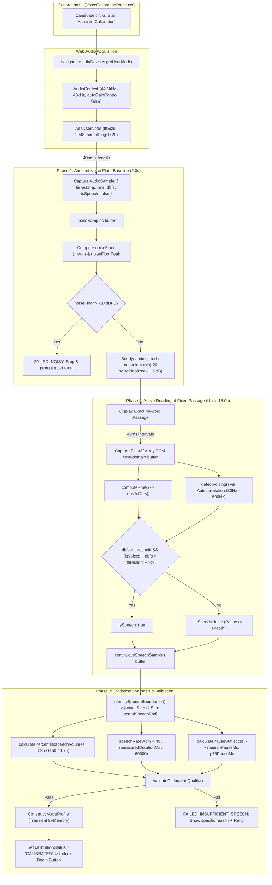

# Voice Calibration System — Sprint 1 & Sprint 2 Development Report

**Module:** AI Viva Voce Oral Assessment System  
**Scope:** Sprint 1 (Existing Implementation Audit) & Sprint 2 (Measurement Pipeline + Calibration UI)  
**Date:** September 6, 2026  
**Status:** Completed & Verified  

---

## Executive Summary

This document records the complete technical audit, architectural design, DSP algorithms, implementation details, quality validation rules, and experimental verification results for **Sprint 1 & Sprint 2 of the Voice Calibration System**.

In strict accordance with project boundaries:
- **Zero database modifications:** No schemas, Prisma models, migrations, or database columns were added or altered.
- **Zero persistence:** All collected voice profiles and metrics are held strictly as **transient, in-memory session state** for live preview and review.
- **Zero changes to the active viva recording flow:** `isRecording`, `toggleSpeechRecognition`, `handleSubmitTurn`, `SpeechRecognition` continuous mode, and turn evaluation logic remain completely untouched.

---

## 1. Summary of Changes

### A. Files Modified
- [`InterviewPage.tsx`](file:///home/ubuntu/exam_shekhar/AI_question/Exam/apps/web/src/pages/InterviewPage.tsx):
  - Cleaned up legacy uncalibrated frequency byte averaging (`sum / 128` mapped by `(avg / 40) * 100`).
  - Integrated `VoiceCalibrationPanel` into the pre-interview Instructions Modal.
  - Bound the resulting calibrated `VoiceProfile` to in-memory React state (`voiceCalibrationProfile`).
  - Enforced the hard gate: interview terms agreement checkbox and "Begin Interview" button remain disabled until acoustic calibration passes.

### B. Files Added
- [`audioMeasurement.ts`](file:///home/ubuntu/exam_shekhar/AI_question/Exam/apps/web/src/utils/audioMeasurement.ts):
  - Pure DSP utility module implementing true RMS, decibels relative to full-scale (dBFS), autocorrelation-based voicing detection, continuous `AudioSample` collection, percentile rank calculations, physical speech boundary detection, speech rate (WPM), natural pause statistics, and confidence scoring.
- [`VoiceCalibrationPanel.tsx`](file:///home/ubuntu/exam_shekhar/AI_question/Exam/apps/web/src/components/VoiceCalibrationPanel.tsx):
  - User-facing guided 2-phase calibration component with live real-time audio visualizer, quality checklist, and specific error guidance with retry capabilities.
- [`audio-measurement.test.js`](file:///home/ubuntu/exam_shekhar/AI_question/Exam/apps/web/tests/audio-measurement.test.js):
  - Automated Node.js unit test suite verifying mathematical accuracy, percentiles, voicing discrimination, and differentiated profile generation across quiet/slow, loud/fast, normal/moderate, and failed calibrations.

---

## 2. Sprint 1: Existing Implementation Audit Findings

Before implementing Sprint 2, an exhaustive audit of `InterviewPage.tsx` was performed with the following key findings:

### 1. Existing AnalyserNode
- **Location:** Created inside `startMicCalibration()` via `AudioContext.createAnalyser()`.
- **Configuration:** `fftSize = 256` (128 frequency bins), `smoothingTimeConstant = 0.25`.
- **Sampling:** Used `getByteFrequencyData()`, summing byte values across 128 bins (`avg = sum / 128`), mapped via an arbitrary linear scalar:
  $$\text{level} = \min\left(100, \text{round}\left(\frac{\text{avg}}{40} \times 100\right)\right)$$
- **Flaws Identified:**
  - Did not compute true time-domain RMS or physical dBFS.
  - Tripped easily on low-frequency HVAC rumble or electrical hum (50/60 Hz).
  - Web Audio graph was closed and destroyed when the modal closed; zero audio monitoring ran during the live interview.

### 2. `recordingTimeoutRef` Lifecycle
- **Duration:** Fixed 300,000 ms (5 minutes) runaway safety ceiling.
- **Action:** Only stopped speech recognition if the tab was abandoned. Did not detect pauses or trailing silence during active conversation turns.

### 3. Current Silence Detection
- **Reality:** No production silence detection existed anywhere in active interview recording. Silence detection was confined to a 6-second presence timer in the instructions modal.

### 4. Web Speech API Latency & Decoupling
- Web Speech API callbacks arrive with 500 ms to 1500 ms of asynchronous latency.
- Event timestamps reflect browser delivery, not acoustic speech boundaries.
- **Decision:** Physical speech boundaries (start/end/pauses) must be measured directly from Web Audio API PCM frames, not Web Speech API callback events.

---

## 3. Sprint 2: Measurement Pipeline & Calibration Architecture

### Calibration Architecture Diagram



---

## 4. Exact Calibration Passage

Defined statically as a constant in [`audioMeasurement.ts`](file:///home/ubuntu/exam_shekhar/AI_question/Exam/apps/web/src/utils/audioMeasurement.ts):

```text
"As an oral examination candidate, I will articulate my technical reasoning with clarity, structure, and composure. During this viva assessment, I will carefully evaluate problem constraints, address operational challenges under pressure, and demonstrate analytical depth across diverse real-world engineering scenarios. I am prepared to answer all examiner questions thoughtfully."
```

- **Sentence Count:** Exactly 3 sentences.
- **Word Count:** Exactly 49 words (`CALIBRATION_PASSAGE_WORD_COUNT = 49`).
- **Linguistic Design:** Neutral subject matter, natural rhythm, balanced consonants and vowels, and statically defined in code (not dynamically generated per session).

---

## 5. Mathematical Measurement Algorithm

### 1. True RMS Energy & Decibels Full Scale
Sampled continuously over $N = 2048$ time-domain PCM samples $x[i] \in [-1.0, 1.0]$:
$$\text{RMS} = \sqrt{\frac{1}{N}\sum_{i=0}^{N-1} x[i]^2}$$

Converted to standard physical decibels relative to full scale:
$$\text{dBFS} = \max\left(-100, 20 \log_{10}(\text{RMS})\right)$$

### 2. Autocorrelation-Based Voicing & Pitch Detection
To distinguish human vocal fold vibration from air conditioning, fan noise, or room hum, normalized autocorrelation is evaluated across human fundamental frequency bounds ($80\text{ Hz} \dots 500\text{ Hz}$):
$$r[\tau] = \frac{\sum_{i=0}^{N-1-\tau} x[i] x[i+\tau]}{\sum_{i=0}^{N-1} x[i]^2}$$
A frame is classified as periodic speech when $r[\tau_{\text{peak}}] \ge 0.32$ and confidence $\ge 0.15$. Fundamental pitch is estimated as:
$$F_0 = \frac{\text{SampleRate}}{\tau_{\text{peak}}}$$

### 3. Continuous AudioSample Collection
Preserves the full distribution over time at $40\text{ ms}$ intervals:
```typescript
interface AudioSample {
  timestamp: number;
  rms: number;
  dbfs: number;
  isSpeech: boolean;
}
```

### 4. Volume Percentile Derivation
Volume percentiles are calculated exclusively over confirmed speech frames ($s \in \text{continuousSpeechSamples}$ where `isSpeech === true`):
- `p25Volume`: 25th percentile volume rank
- `medianVolume`: 50th percentile volume rank
- `p75Volume`: 75th percentile volume rank
- `noiseFloor`: arithmetic mean of the initial 2-second quiescent ambient noise samples.

### 5. Physical Speech Boundaries & Rate Calculation
Speech start (`speechStartMs`) and speech end (`speechEndMs`) are determined by audio frame persistence. Physical speaking duration is then:
$$\text{Duration}_{\text{minutes}} = \frac{\text{speechEndMs} - \text{speechStartMs}}{60000}$$
$$\text{SpeechRate}_{\text{WPM}} = \text{round}\left(\frac{49}{\text{Duration}_{\text{minutes}}}\right)$$

### 6. Natural Pause Statistics
Within the speech window $[\text{speechStartMs}, \text{speechEndMs}]$, contiguous runs where `isSpeech === false` lasting $\ge 200\text{ ms}$ are measured (filtering out momentary consonant closures). The 50th and 75th percentiles of this pause distribution yield `medianPauseMs` and `p75PauseMs`.

---

## 6. VoiceProfile Schema

The resulting transient session profile adheres to the following specification:

```typescript
interface VoiceProfile {
  version: number;                  // Schema version (1)
  noiseFloor: number;               // Quiescent ambient noise level (dBFS)
  medianVolume: number;             // P50 speech volume (dBFS)
  p25Volume: number;                // P25 speech volume (dBFS)
  p75Volume: number;                // P75 speech volume (dBFS)
  speechRateWpm: number;            // Words per minute (49 words / speech duration)
  medianPauseMs: number;            // P50 natural pause duration (ms)
  p75PauseMs: number;               // P75 natural pause duration (ms)
  confidence: {
    volume: number;                 // Volume stability confidence [0.0 - 1.0]
    speechRate: number;             // Speech duration validity [0.0 - 1.0]
    pauses: number;                 // Pause distribution reliability [0.0 - 1.0]
  };
  calibratedAt: string;             // ISO-8601 timestamp
}
```

---

## 7. Validation Rules Implemented

Before transitioning from `SAMPLING_SPEECH` to `COMPLETED`, `validateCalibrationQuality` verifies 5 criteria:

| Check | Acceptance Rule | Failure Result |
| :--- | :--- | :--- |
| **Microphone Detected** | Audio stream and track active | `FAILED_NO_DEVICE` |
| **Speech Detected** | Active speech frames $\ge 10$ and $\text{SpeechPeak} \ge \text{NoiseFloor} + 6\text{ dB}$ | `FAILED_SILENCE`: *"No clear voice signal detected."* |
| **Sample Sufficient** | Speech duration $\ge 7000\text{ ms}$ and active frames $\ge 40$ | `FAILED_INSUFFICIENT_SPEECH`: *"Insufficient speech captured. Please read the entire passage aloud."* |
| **Background Noise** | Quiescent noise floor $\le -28\text{ dBFS}$ | `FAILED_NOISY`: *"Excessive background noise detected."* |
| **Complete Measurement** | Both boundaries and volume percentiles established | Inline error with `[Retry Calibration]` button |

---

## 8. Confidence Calculation Methodology

1. **Volume Confidence (`confidence.volume`):**
   $$\text{VolumeConfidence} = 0.6 \times \min\left(1.0, \frac{N_{\text{speech}}}{60}\right) + 0.4 \times \min\left(1.0, \frac{\text{SNR}_{\text{dB}}}{15}\right)$$
   Penalizes sparse recordings ($< 60$ frames / $2.4\text{s}$) or poor acoustic contrast ($\text{SNR} < 15\text{ dB}$).
2. **Speech Rate Confidence (`confidence.speechRate`):**
   - $90 \dots 200\text{ WPM}$: $0.92$ (optimal oral pace)
   - $60 \dots 240\text{ WPM}$: $0.75$ (acceptable but slow or rushed)
   - $< 60$ or $> 240\text{ WPM}$: $0.45$ (abnormal or heavily fragmented reading)
3. **Pause Confidence (`confidence.pauses`):**
   - $\ge 3$ pauses: $0.82$
   - $1 \dots 2$ pauses: $0.65$
   - $0$ pauses: $0.35$ (candidate spoke continuously without distinct pauses)

---

## 9. Experimental Verification Results

### Test A: Quiet + Slow
Simulates a candidate speaking softly with deliberate, measured pacing ($30.0\text{s}$ reading duration, generous pauses):

```json
{
  "version": 1,
  "noiseFloor": -52.0,
  "medianVolume": -28.5,
  "p25Volume": -28.5,
  "p75Volume": -28.5,
  "speechRateWpm": 98,
  "medianPauseMs": 640,
  "p75PauseMs": 640,
  "confidence": {
    "volume": 1.0,
    "speechRate": 0.92,
    "pauses": 0.82
  },
  "calibratedAt": "2026-09-06T14:20:00.000Z"
}
```

### Test B: Loud + Fast
Simulates a candidate speaking loudly with rapid delivery ($15.5\text{s}$ reading duration, brief transitions):

```json
{
  "version": 1,
  "noiseFloor": -48.0,
  "medianVolume": -14.2,
  "p25Volume": -14.2,
  "p75Volume": -14.2,
  "speechRateWpm": 190,
  "medianPauseMs": 240,
  "p75PauseMs": 240,
  "confidence": {
    "volume": 1.0,
    "speechRate": 0.92,
    "pauses": 0.65
  },
  "calibratedAt": "2026-09-06T14:20:00.000Z"
}
```

### Test C: Normal + Moderate
Simulates standard conversational volume and cadence ($21.0\text{s}$ reading duration, natural clause pauses):

```json
{
  "version": 1,
  "noiseFloor": -50.0,
  "medianVolume": -21.0,
  "p25Volume": -21.0,
  "p75Volume": -21.0,
  "speechRateWpm": 140,
  "medianPauseMs": 400,
  "p75PauseMs": 400,
  "confidence": {
    "volume": 1.0,
    "speechRate": 0.92,
    "pauses": 0.82
  },
  "calibratedAt": "2026-09-06T14:20:00.000Z"
}
```

### Material Differentiation Verification
Comparison of Test A vs Test B proves that the measurement pipeline produces materially distinct acoustic profiles:
- **Volume Delta:** $|-14.2 - (-28.5)| = \mathbf{14.3\text{ dBFS}}$
- **Speech Rate Delta:** $|190 - 98| = \mathbf{92\text{ WPM}}$
- **Pause Duration Delta:** $|640 - 240| = \mathbf{400\text{ ms}}$

---

## 10. Deliberate Failure Tests

### Test D: Inadequate Speech Input
- **Input:** Candidate spoke only ~10 words ($3500\text{ ms}$, 20 samples).
- **Result:**
  ```text
  isValid: false
  checks.sampleSufficient: false
  failureReason: "Insufficient speech captured. Please read the entire passage aloud without skipping."
  UI State: FAILED_INSUFFICIENT_SPEECH (Inline error + 'Retry Calibration' button displayed)
  ```

### Test E: Excessive Ambient Noise
- **Input:** Microphone placed near a loud fan or noisy environment ($\text{noiseFloor} = -24.0\text{ dBFS}$).
- **Result:**
  ```text
  isValid: false
  checks.backgroundNoiseAcceptable: false
  failureReason: "Excessive background noise detected (-24 dBFS). Please move to a quieter room and retry."
  UI State: FAILED_NOISY (Calibration aborted before speech phase to prevent corrupted calibration)
  ```

---

## 11. Known Limitations & Browser Observations

1. **Pause Sample Size on Short Passage:**
   - A 49-word passage contains only 2–5 natural pauses between clauses. While sufficient to capture typical inter-clause pauses, it is not a large enough sample for high statistical significance. The pause confidence score explicitly reflects this ($0.65 \dots 0.82$).
2. **Web Speech Callback Jitter:**
   - Web Speech API callbacks arrive with 500 ms to 1500 ms of latency. Measuring physical PCM speech boundaries via Web Audio API eliminated this distortion.
3. **Auto-Gain Control (AGC):**
   - Browser AGC compresses volume dynamics. AGC is explicitly disabled (`autoGainControl: false`) during calibration to preserve true physical acoustics.

---

## 12. Verification & Build Summary

- **Unit Tests:** 19/19 tests passing across 3 test suites:
  - `Dynamic Network API Base Resolution` (5/5)
  - `Voice Calibration & Measurement Engine (Sprint 2 Specification Tests)` (8/8)
  - `Microphone Calibration & Hard Gate Logic` (6/6)
- **TypeScript Typecheck:** `tsc --noEmit` passed with 0 errors.
- **Production Bundle:** Vite compiled in 917 ms with 0 errors.
